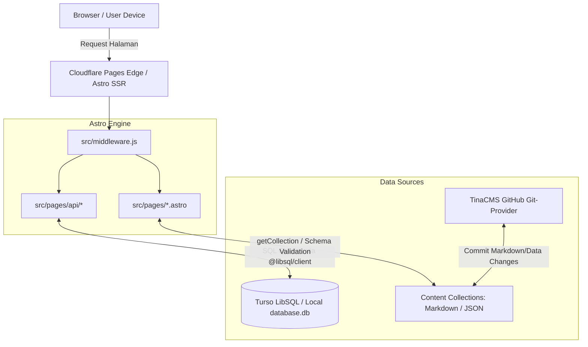

# 📚 Dokumen Orientasi Pengembang (Developer Onboarding Guide)
**Proyek:** Web Portal & Sistem Informasi Madrasah Aliyah (MAS MIFHDA / MA Miftahul Huda)  
**Target Pembaca:** Mid-Level Fullstack / Frontend Developer  
**Peran Mentor:** Senior Software Engineer  

---

## 1. 🎯 Ringkasan Proyek (Project Overview)

### Tujuan Utama & Fitur Inti
Aplikasi ini adalah portal web sekolah modern yang menggabungkan website profil publik (*branding & company profile*) dengan sistem informasi operasional sekolah (*school management micro-services*).

Aplikasi dibangun dengan fokus pada kecepatan performa (*Core Web Vitals*), kemudahan pengelolaan konten tanpa coding, dan otomasi administrasi siswa baru.

#### Fitur-Fitur Inti:
1. **Portal Publik & Profil Sekolah**:
   - Beranda interaktif dengan hero banner, sambutan kepala sekolah, visi-misi, galeri fasilitas, program ekstrakurikuler, dan profil struktur kepengurusan OSIS & Dewan Guru/Staf.
   - Blog, Berita, & Pengumuman dengan filter kategori (`akademik`, `kurikulum`, `prestasi`, `news`, `pengumuman`), sistem penjadwalan rilis (*scheduled posts*), dan status draf/takedown.
2. **Sistem SPMB / PPDB Online (Penerimaan Peserta Didik Baru)**:
   - Formulir pendaftaran multi-step interaktif dengan validasi data siswa dan orang tua/wali.
   - Pembuatan kode pendaftaran unik secara otomatis (format: `SPMB-[TIMESTAMP]-[RANDOM]`).
   - Fitur pelacakan status pendaftaran mandiri oleh calon siswa.
   - Fitur cetak/ekspor bukti formulir pendaftaran digital menggunakan `html2canvas`.
3. **Dashboard Admin PPDB**:
   - Sistem login admin berbasis hash otentikasi SHA-256 dan session management.
   - Tabel manajemen data pendaftar (lihat detail, ubah status: `pending`, `diverifikasi`, `diterima`, `ditolak`).
   - Ekspor data pendaftar ke format file (CSV/Excel).
4. **Sistem Cek Kelulusan Siswa**:
   - Pengecekan status kelulusan peserta didik secara realtime berdasarkan NISN / No. Ujian.
5. **Headless CMS Terintegrasi (TinaCMS)**:
   - Panel visual editing untuk staf humas sekolah mengelola konten artikel, halaman profil, dan konfigurasi situs langsung melalui antarmuka web yang terhubung ke repositori Git.
6. **Optimasi SEO & Analytics**:
   - Integrasi otomatis `sitemap.xml`, `robots.txt`, OpenGraph/Twitter Cards, Google Tag Manager (GTM), dan metadata JSON-LD Structured Data Schema (`schema-dts`).

### Target Pengguna (Audience)
- **Calon Siswa & Orang Tua/Wali**: Mengakses informasi pendaftaran PPDB, mengisi formulir, memeriksa status seleksi, dan melihat profil sekolah.
- **Siswa Aktif & Alumni**: Membaca artikel kegiatan, pengumuman sekolah, informasi OSIS, dan mengecek kelulusan.
- **Tim Humas / Kontributor Konten**: Mengunggah berita, galeri foto, dan artikel melalui TinaCMS.
- **Panitia PPDB / Administrator Sekolah**: Memvalidasi data pendaftar baru dan mengelola berkas administrasi melalui Dashboard Admin.

---

## 2. 🏗️ Arsitektur dan Teknologi (Architecture & Tech Stack)

### Tech Stack Matrix
| Layer | Teknologi | Keterangan & Rationale |
| :--- | :--- | :--- |
| **Core Framework** | **Astro 5 (SSR Mode)** | Framework berbasis *Islands Architecture* yang menghasilkan HTML murni untuk performa maksimal. |
| **Language** | **TypeScript 5 & JavaScript (ESM)** | Type safety di tingkat schema konten, API, dan komponen. |
| **Runtime & Adapter** | **Cloudflare Pages (`@astrojs/cloudflare`)** | Dijalankan di Edge Network Cloudflare dengan `nodejs_compat`. |
| **Styling & CSS** | **Tailwind CSS v4 (`@tailwindcss/vite`)** | Utility-first CSS generasi terbaru dengan build engine Vite native. |
| **Client-side Interactivity** | **Alpine.js (`@astrojs/alpinejs`)** | Library reaktivitas minimalis (~15kb) untuk form validation, modal, dan tab tanpa perlu overhead bundle React runtime di sisi user. |
| **Database** | **LibSQL / Turso (`@libsql/client`)** | Serverless SQLite di edge dengan replikasi global, mendukung file SQLite lokal untuk development offline. |
| **Content Management** | **TinaCMS v3** | Git-backed Headless CMS yang menyimpan data dalam Markdown/JSON di repositori GitHub. |
| **Animation & Media** | **GSAP & Splide.js** | Slider galeri dan micro-animation yang halus. |
| **Keamanan & Auth** | **Web Crypto API (SubtleCrypto)** | Standar kriptografi native browser/edge worker (SHA-256) untuk verifikasi credential admin. |

### Diagram Arsitektur & Alur Data



### Pola Arsitektur: *Islands Architecture + Edge SSR Hybrid*
1. **Server-Side Rendering (SSR)**: Dikonfigurasi dengan `output: "server"`, memungkinkan rute API dinamis (`/api/pendaftaran/*`) dan halaman admin memproses autentikasi serta interaksi database secara on-demand.
2. **Zero JS by Default (Islands Architecture)**: Halaman informasi statis dirender menjadi HTML bersih di server. Hanya pulau-pulau interaktif (seperti Form PPDB yang menggunakan directive Alpine.js) yang mengeksekusi JavaScript di sisi klien.
3. **Database Client Abstraction**: Memanfaatkan `@libsql/client` yang fleksibel: di lokal dapat membaca file database SQLite `file:database.db`, sedangkan di production tersambung ke cloud database Turso melalui protocol `libsql://`.

---

## 3. 💻 Panduan Setup Lingkungan Lokal (Local Development Setup)

### Prasyarat Sistem
- **Node.js**: Versi `18.20.0+` atau `20.x LTS` (disarankan `Node 20 LTS`).
- **Package Manager**: `npm` (bawaan Node.js) atau `bun`.
- **Git**: Terpasang di komputer.

### Langkah-langkah Instalasi

#### 1. Clone Repository & Masuk Direktori
```bash
git clone https://github.com/masmifhda083/web-masmifhda-083.git
cd web-masmifhda-083
```

#### 2. Install Dependensi
```bash
npm install
```

#### 3. Konfigurasi Environment Variables (`.env`)
Buat file `.env` di root direktori proyek (duplikasi dari konfigurasi standar):
```env
# Database Configuration (Gunakan local SQLite untuk dev offline atau URL Turso)
TURSO_DATABASE_URL=file:database.db
TURSO_AUTH_TOKEN=

# TinaCMS & GitHub Integration (Opsional saat dev lokal murni)
TINA_CLIENT_ID=your_tina_client_id
TINA_TOKEN=your_tina_token
GITHUB_PERSONAL_ACCESS_TOKEN=your_github_pat
GITHUB_BRANCH=main
GITHUB_OWNER=masmifhda083
GITHUB_REPO=web-masmifhda-083

# Admin Credentials
ADMIN_USERNAME=admin
# SHA-256 hash untuk password 'admin123' (atau sesuaikan dengan hash generator)
ADMIN_PASSWORD_HASH=240be518fabd2724ddb6f04eeb1da5967448d7e831c08c8fa822809f74c720a9
SESSION_SECRET=super-secret-key-change-in-production-min-32-chars
```

#### 4. Inisialisasi Skema Database
Untuk menyiapkan tabel `users` (pendaftaran siswa baru) pada database lokal/Turso, jalankan skrip inisialisasi:
```bash
npx tsx setup-db.ts
```

#### 5. Menjalankan Development Server
Jalankan dev server yang terintegrasi dengan TinaCMS:
```bash
npm run dev
```
- **Website Utama**: Buka browser di [http://localhost:4321](http://localhost:4321)
- **TinaCMS Visual Editor**: Buka di [http://localhost:4321/admin](http://localhost:4321/admin)
- **Dashboard Admin PPDB**: Buka di [http://localhost:4321/dashboard/login](http://localhost:4321/dashboard/login)

---

## 4. 📂 Struktur Folder & Alur Kerja (Folder Structure & Workflow)

### Peta Direktori Utama
```text
├── .agents/                 # AI agent skills & custom developer tooling
├── public/                  # Asset publik statis (favicon, logo, banner raw)
├── src/
│   ├── api/                 # Helper & handler logika API internal
│   ├── components/          # Komponen UI Astro (Navbar, Footer, SEO, CardPosts, dll.)
│   ├── config/              # Konfigurasi aplikasi tambahan
│   ├── content/             # Data & Content Collections Astro (berita, guru, halaman)
│   │   ├── config.ts        # Zod Schema definition untuk semua koleksi konten
│   │   ├── posts/           # File artikel Markdown (.md)
│   │   ├── staff/           # Data staf & tenaga pengajar
│   │   ├── osis/            # Data kepengurusan OSIS
│   │   └── settings/        # Konfigurasi website (website.json)
│   ├── layouts/             # Template layout dasar (Layout.astro, Article.astro)
│   ├── lib/                 # Core backend utilities
│   │   ├── auth.ts          # Autentikasi Admin, Session Management & Password Hashing
│   │   └── db.ts            # Client LibSQL & operasi CRUD tabel pendaftaran
│   ├── middleware.js        # Middleware routing, rewrite URL, & normalisasi path
│   ├── pages/               # File-based routing Astro
│   │   ├── index.astro      # Homepage
│   │   ├── pendaftaran.astro# Halaman formulir pendaftaran PPDB
│   │   ├── cek-kelulusan.astro # Halaman cek kelulusan siswa
│   │   ├── posts/           # Rute dinamis daftar berita & detail artikel
│   │   ├── dashboard/       # Halaman admin panel PPDB
│   │   └── api/             # Endpoint REST API (JSON)
│   │       ├── admin/       # API auth login/logout & session check
│   │       ├── kelulusan/   # API pencarian kelulusan
│   │       └── pendaftaran/ # API CRUD pendaftar (register, list, update-status, export)
│   └── styles/              # Global CSS & integrasi Tailwind
├── tina/                    # Konfigurasi skema TinaCMS & custom component React
│   ├── config.ts            # Definisi fields, collections, dan git provider TinaCMS
│   └── PendaftaranScreen.tsx# Custom UI screen untuk Tina admin
├── astro.config.mjs         # Konfigurasi integrasi Astro (Vite, Cloudflare, Alpine, SEO)
├── setup-db.ts              # Script migrasi/setup struktur tabel database
├── hash.js                  # Helper utilitas untuk generate SHA-256 password hash
└── wrangler.toml            # Konfigurasi deployment Cloudflare Pages & runtime flags
```

### Alur Pemrosesan Data (Data Flow Lifecycle)

#### A. Alur Pendaftaran Siswa Baru (PPDB Flow):
1. **User Input**: Pengunjung mengisi form di `src/pages/pendaftaran.astro` yang dikontrol oleh state Alpine.js (`x-data="pendaftaranForm()"`).
2. **Client Validation**: Alpine.js memvalidasi kelengkapan form di browser.
3. **HTTP POST Request**: Client mengirim payload JSON ke `/api/pendaftaran/register`.
4. **Backend Processing (`src/pages/api/pendaftaran/register.ts`)**:
   - Menerima payload & melakukan sanitasi data.
   - Memanggil `insertUser()` di `src/lib/db.ts`.
   - Mengenerate kode unik `kode_pendaftaran`.
   - Menyimpan record ke database Turso via `@libsql/client`.
5. **Response**: Server mengembalikan JSON `{ success: true, kode_pendaftaran: "SPMB-xxx" }`.
6. **Confirmation & Bukti**: Browser merender bukti pendaftaran dan menyediakan tombol cetak/screenshot via `html2canvas`.

#### B. Alur Manajemen Konten (CMS Flow):
1. Kontributor mengakses `/admin/`.
2. TinaCMS membaca skema dari `tina/config.ts`.
3. Ketika artikel baru disimpan, TinaCMS menulis file Markdown ke folder `src/content/posts/[kategori]/[slug].md` atau meng-commit ke Git remote.
4. Astro Content Collections memvalidasi tipe data melalui `src/content/config.ts` (Zod schema) saat halaman dirender.

---

## 5. 📏 Standar dan Konvensi Kode (Code Standards & Conventions)

### 1. Standar Penulisan Kode (Code Style)
- **TypeScript**: Gunakan type interface eksplisit untuk fungsi data handling dan API payload.
- **Komponen Astro**:
  - Tulis logika server (data fetching, parsing URL, metadata) di bagian Frontmatter (`---`).
  - Gunakan elemen semantik HTML5 (`<header>`, `<nav>`, `<main>`, `<article>`, `<footer>`).
- **Client Scripts (Alpine.js)**:
  - Gunakan Alpine.js untuk state reaktif lokal di browser (`x-data`, `x-show`, `x-on:click`). Hindari menyisipkan vanilla JS DOM manipulation ad-hoc tanpa struktur.
- **CSS Styling**:
  - Gunakan class Tailwind CSS v4.
  - Hindari penulisan inline style (`style="..."`) kecuali untuk dynamic values yang dihitung runtime (seperti progress bar percentage).

### 2. Contoh Standar Implementasi API Endpoint
Setiap API route di `src/pages/api/` wajib menangani error handling dengan status code yang sesuai:

```typescript
// src/pages/api/example.ts
import type { APIRoute } from 'astro';

export const POST: APIRoute = async ({ request }) => {
  try {
    const body = await request.json();
    
    // 1. Input Validation
    if (!body.requiredField) {
      return new Response(JSON.stringify({ 
        success: false, 
        message: 'Field wajib diisi' 
      }), {
        status: 400,
        headers: { 'Content-Type': 'application/json' }
      });
    }

    // 2. Business Logic Execution
    // ... logic code ...

    return new Response(JSON.stringify({ 
      success: true, 
      data: result 
    }), {
      status: 200,
      headers: { 'Content-Type': 'application/json' }
    });
  } catch (error) {
    console.error('API Error:', error);
    return new Response(JSON.stringify({ 
      success: false, 
      message: 'Terjadi kesalahan internal server' 
    }), {
      status: 500,
      headers: { 'Content-Type': 'application/json' }
    });
  }
};
```

### 3. Git Branching & Pull Request (PR) Workflow
- **Branch Naming**:
  - `feature/nama-fitur` (contoh: `feature/ppdb-export-pdf`)
  - `bugfix/deskripsi-bug` (contoh: `bugfix/fix-login-session`)
  - `refactor/nama-modul` (contoh: `refactor/tina-schema`)
- **Conventional Commits**:
  - `feat:` Menambahkan fitur baru.
  - `fix:` Memperbaiki bug.
  - `docs:` Perubahan dokumentasi.
  - `refactor:` Restrukturisasi kode tanpa mengubah fungsionalitas.
  - `chore:` Update dependensi atau konfigurasi build.
- **Pull Request Checklist**:
  1. Pastikan `npm run build` sukses tanpa error TypeScript.
  2. Uji endpoint API yang dimodifikasi.
  3. Pastikan tidak ada credential sensitif/API token yang ter-commit ke Git.

---

## 6. 🛠️ FAQ & Troubleshooting

### Q1: Error koneksi Turso Database (`LibsqlError: SERVER_ERROR` / `fetch failed`)
**Penyebab**: Koneksi internet terputus, URL Turso salah, atau token autentikasi kedaluwarsa.  
**Solusi**:
Untuk pengembangan lokal tanpa koneksi Turso cloud, ubah konfigurasi `.env`:
```env
TURSO_DATABASE_URL=file:database.db
TURSO_AUTH_TOKEN=
```
Lalu jalankan kembali `npx tsx setup-db.ts` untuk membuat SQLite lokal.

---

### Q2: Error saat build TinaCMS (`TinaCloud error` / `Invalid token`)
**Penyebab**: Build production menjalankan pengecekan cloud token Tina padahal menggunakan self-hosted Git.  
**Solusi**:
Gunakan script build yang melewati pengecekan cloud:
```bash
npm run build:with-tina
```
Script ini mengeksekusi `tinacms build --skip-cloud-checks && astro build`.

---

### Q3: Password login admin tidak cocok / lupa password
**Penyebab**: Hash di `.env` (`ADMIN_PASSWORD_HASH`) tidak cocok dengan input teks biasa.  
**Solusi**:
Generate hash baru menggunakan `hash.js`:
1. Edit file `hash.js`, masukkan password yang diinginkan di variabel `password`.
2. Jalankan di terminal:
   ```bash
   node hash.js
   ```
3. Copy output string heksadesimal ke `.env` pada key `ADMIN_PASSWORD_HASH`.

---

### Q4: Error Cloudflare Pages runtime `Node.js built-in module not found`
**Penyebab**: Menggunakan module Node.js (seperti `node:fs` atau `node:crypto`) di dalam kode yang dieksekusi pada runtime Cloudflare Edge Workers.  
**Solusi**:
1. Gunakan Web Standard APIs seperti `crypto.subtle` (lihat contoh di `src/lib/auth.ts`).
2. Pastikan `wrangler.toml` memiliki konfigurasi flag:
   ```toml
   compatibility_flags = ["nodejs_compat"]
   ```

---

## 🚀 Langkah Pertama untuk Anda (Quick Action Checklist)
1. [ ] Jalankan `npm install` dan pastikan seluruh dependencies terpasang.
2. [ ] Siapkan `.env` lokal dengan `TURSO_DATABASE_URL=file:database.db`.
3. [ ] Jalankan `npx tsx setup-db.ts` untuk memverifikasi database lokal.
4. [ ] Jalankan `npm run dev` dan buka `http://localhost:4321` di browser Anda.
5. [ ] Coba lakukan test pendaftaran di menu PPDB untuk memahami end-to-end flow data.

*Selamat bergabung di tim pengembang MAS MIFHDA! Jika ada kendala teknis lebih lanjut, konsultasikan langsung dengan Senior Engineer.*
